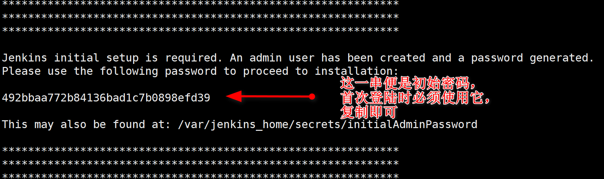
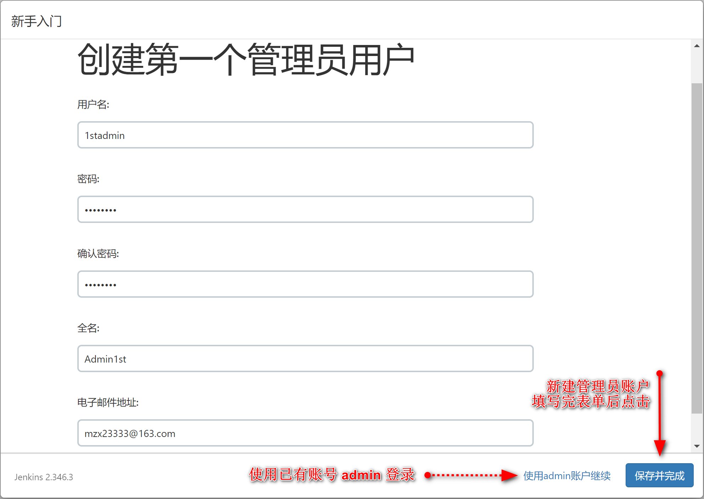
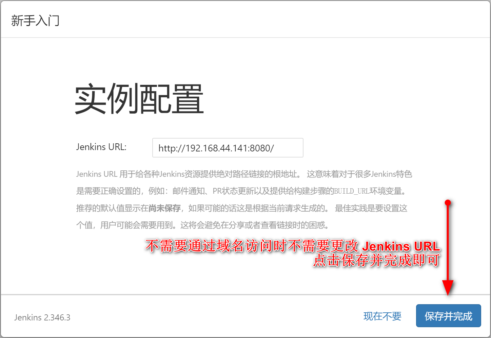
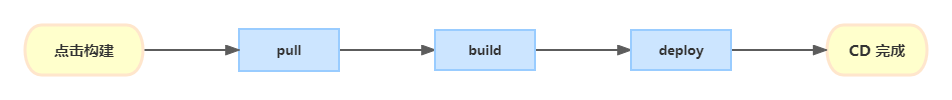

# Jenkins

## 提升镜像拉取速度（可选）

准备镜像配置

```json
{
  "registry-mirrors": [
    "https://hub-mirror.c.163.com",
    "https://mirror.baidubce.com"
  ]
}
```

执行命令

```sh
mkdir /etc/docker
vi /etc/docker/daemon.json
# 将镜像 json 粘贴到 daemon.json 文件中，保存并退出后执行下面的命令
systemctl daemon-reload
systemctl restart docker
```

检查配置是否生效（可选）

```sh
docker info
```

若返回的信息含有以下文字则说明设置已经生效：

```sh
 Registry Mirrors:
  https://hub-mirror.c.163.com/
  https://mirror.baidubce.com/
```

## 使用 docker 安装 Jenkins

### 安装与启动

官方教程：[使用 npm 构建 Node.js 和 React 应用](https://www.jenkins.io/zh/doc/tutorials/build-a-node-js-and-react-app-with-npm/)

```sh
docker run \
  -d \
  --name jenkins \
  -u root \
  -p 8080:8080 \
  -v /usr/local/jenkins_home:/var/jenkins_home \
  jenkins/jenkins:lts
```

运行后提示：`Unable to find image 'jenkins/jenkins:lts' locally`，等待几秒钟后会自动拉取 `jenkins/jenkins:lts`

等待拉取与安装完成…

### 初次进入 Jenkins

首次打开 Jenkins 网页时需要输入初始密码

#### 获取初始密码

等待`docker run`运行完成，再运行命令：

```sh
docker logs jenkins
```

输出以下文本，复制 `${初始密码}`

```sh
Jenkins initial setup is required. An admin user has been created and a password generated.
Please use the following password to proceed to installation:

${初始密码}
```



#### 首次打开 Jenkins

1. 浏览器打开`http:${服务器 IP}:8080`

   

2. 选择`安装推荐的插件`

   等待插件安装完成，有些插件可能会安装失败，多次重试安装后仍失败则直接跳过

3. 创建第一个管理员用户

   可以直接使用默认的 `admin` 账号登录（点击`使用admin账户继续`），也可以新建管理员用户；

   为了防止他人猜到账号，这里选择新建管理员用户：填写完表单后点击右下角`保存并完成`

   

4. 配置实例

   不需要通过域名访问时不需要更改 Jenkins URL，点击`保存并完成`即可

   

5. 重启 Jenkins

   即使已经安装了汉化插件有些文本仍是英文，重启后就能变成中文，手动运行命令：

   ```sh
   docker restart jenkins
   ```

Jenkins 的搭建已经完成，后文是通过 Jenkins 实现 CD：

## CD

CD 的主要过程：



## ZDB 相关配置

账密：`zgadmin/pwd@jenkins`

Dashboard - Manage Jenkins - Available plugins
Publish Over SSH
GitLab

Dashboard - Manage Jenkins - System
Git plugin

Publish over SSH - 新增

Name zdb-prod-37
Hostname 37
Username root
Remote Directory /

√ Use password authentication, or use a different key

NodeJS
