# Jenkins

## 提升镜像拉取速度（可选）

检查是否有加速配置，运行命令：

```sh
docker info
```

1. 若返回类似以下文字则说明有镜像加速配置，但镜像源可能是未生效：

   ```sh
   Registry Mirrors:
     https://hub-mirror.c.163.com/
     https://mirror.baidubce.com/
   ```

   执行命令，使源配置生效：

   ```sh
   systemctl daemon-reload
   systemctl restart docker
   ```

2. 若没有返回上述文字，则需要配置镜像源：

   准备镜像配置

   ```json
   {
     "registry-mirrors": [
       "https://hub-mirror.c.163.com",
       "https://mirror.baidubce.com"
     ]
   }
   ```

   执行命令

   ```sh
   mkdir /etc/docker
   vi /etc/docker/daemon.json
   # 将镜像 json 粘贴到 daemon.json 文件中，保存并退出后执行下面的命令
   systemctl daemon-reload
   systemctl restart docker
   ```

   镜像加速配置完成，加速生效。

## 使用 docker 安装 Jenkins

### 安装与启动

官方教程：[使用 npm 构建 Node.js 和 React 应用](https://www.jenkins.io/zh/doc/tutorials/build-a-node-js-and-react-app-with-npm/)

```sh
docker run \
  -d \
  --name jenkins \
  -u root \
  -p 8080:8080 \
  -v /usr/local/jenkins_home:/var/jenkins_home \
  jenkins/jenkins:lts
```

运行后提示：`Unable to find image 'jenkins/jenkins:lts' locally`，等待几秒钟后会自动拉取 `jenkins/jenkins:lts`

等待拉取与安装完成…

### 初次进入 Jenkins

首次打开 Jenkins 网页时需要输入初始密码

#### 获取初始密码

等待`docker run`运行完成，再运行命令：

```sh
docker logs jenkins
```

输出以下文本，复制 `${初始密码}`

```sh
Jenkins initial setup is required. An admin user has been created and a password generated.
Please use the following password to proceed to installation:

${初始密码}
```

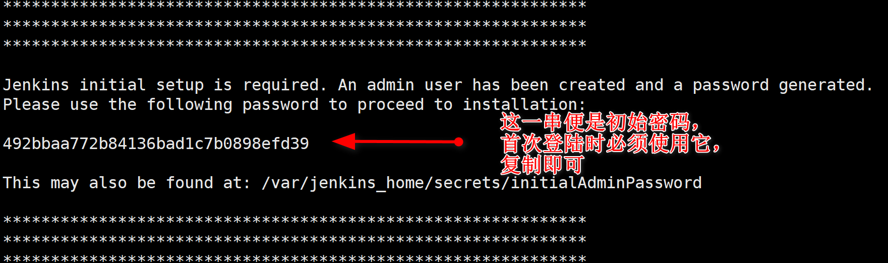

#### 首次打开 Jenkins

1. 浏览器打开`http:${服务器 IP}:8080`

   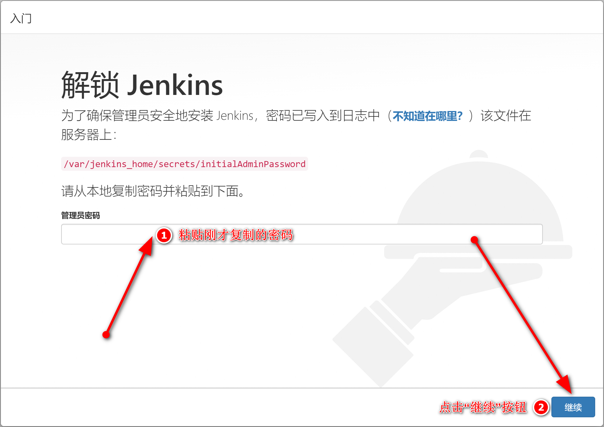

2. 选择`安装推荐的插件`

   等待插件安装完成，有些插件可能会安装失败，多次重试安装后仍失败则直接跳过

3. 创建第一个管理员用户

   可以直接使用默认的 `admin` 账号登录（点击`使用admin账户继续`），也可以新建管理员用户；

   为了防止他人猜到账号，这里选择新建管理员用户：填写完表单后点击右下角`保存并完成`

   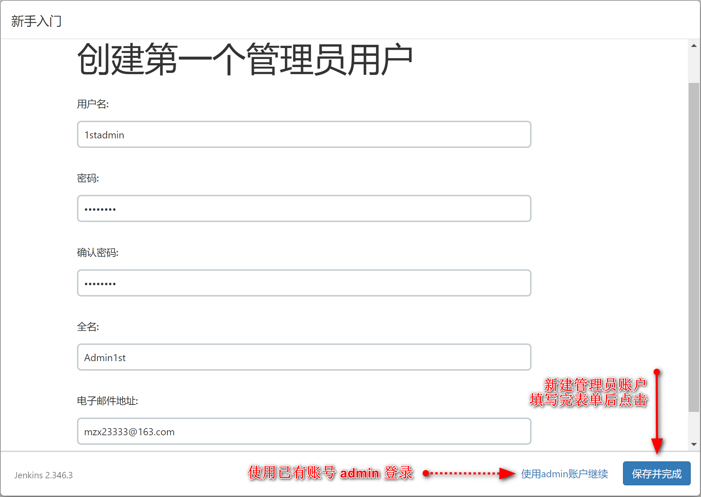

4. 配置实例

   不需要通过域名访问时不需要更改 Jenkins URL，点击`保存并完成`即可

   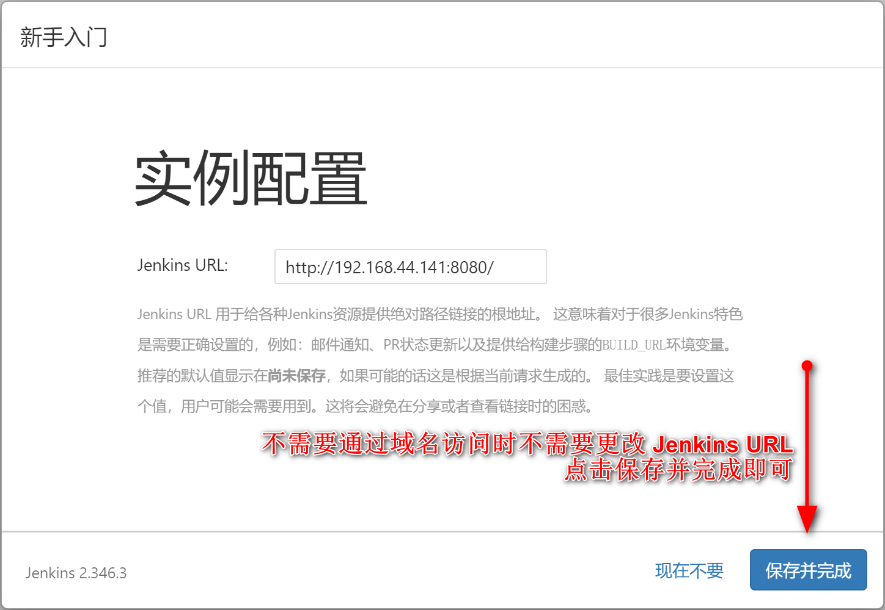

5. 重启 Jenkins

   即使已经安装了汉化插件有些文本仍是英文，重启后就能变成中文，手动运行命令：

   ```sh
   docker restart jenkins
   ```

Jenkins 的搭建已经完成，后文是通过 Jenkins 实现 CD：

## 使用 Jenkins 进行 CD

CD 的主要过程如下：


### 安装 && 配置插件

依次打开插件安装界面：`Dashboard - 系统管理 - 插件管理 - Available plugins`

在搜索输入框内输入插件完整的名称、选中后点击`安装`按钮

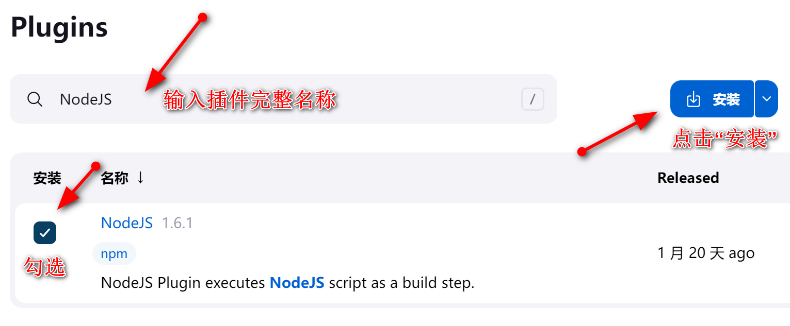

1. `pull`：拉取代码

   1. 安装插件：`Git`（通常作为默认插件在安装 Jenkins 时已自动安装）
   2. 插件安装完成过后依次打开 `Dashboard - 系统管理 - 系统配置`，找到`Git plugin`，填写本地 git 账户的昵称与邮箱、点击保存
      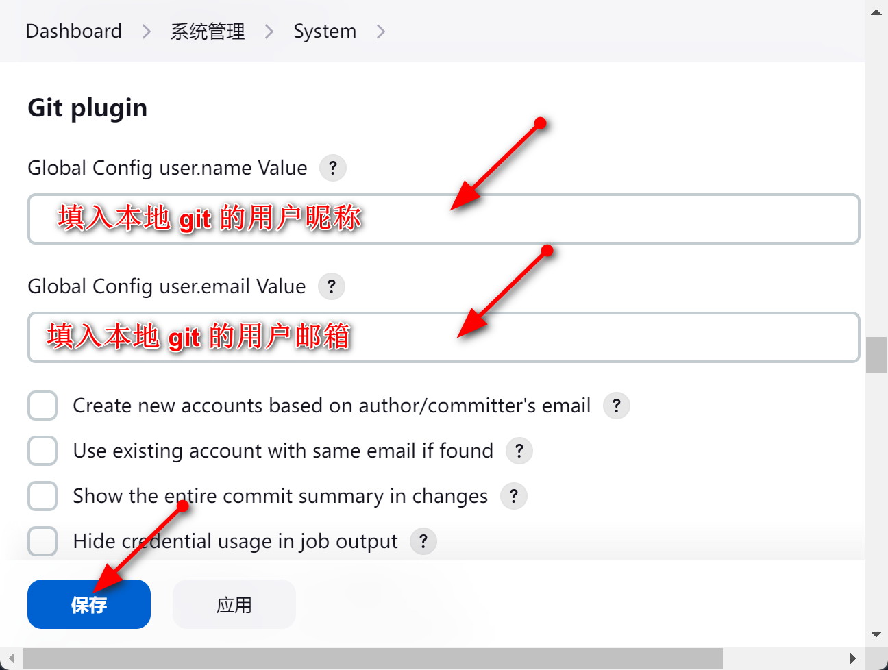

   3. 配置 gitlab 凭据

      依次打开 `Dashboard - 系统管理 - 凭据管理 - 添加凭据`
      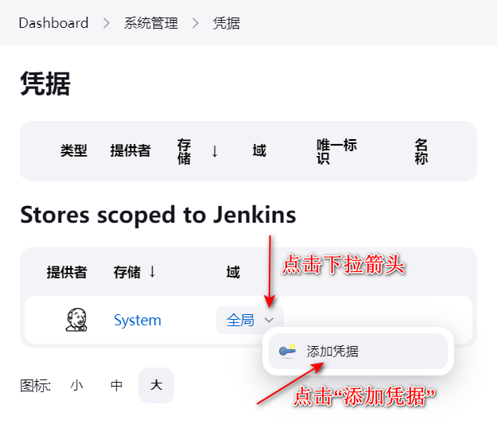

      选择`Username with password`，填入登录 gitlab 时使用的账号密码以及其他附属信息，最后点击`Create`
      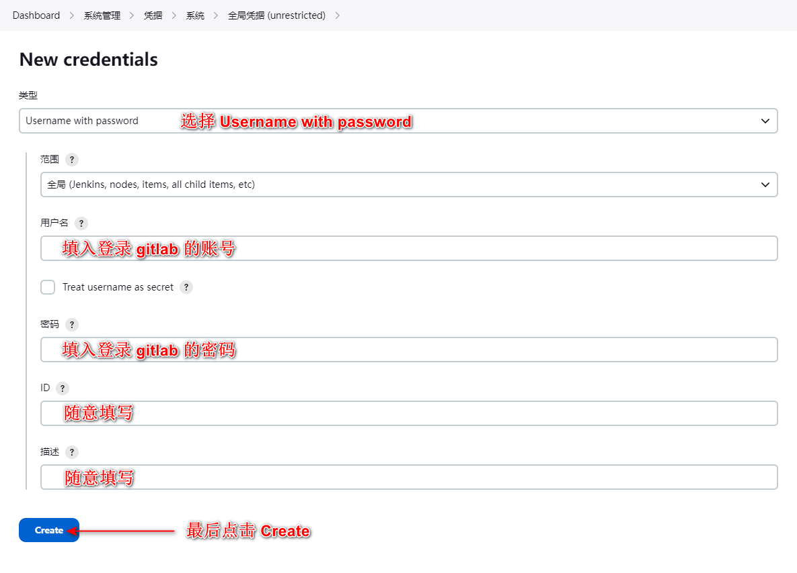

2. `build`：执行构建命令，需要 `nodejs` 环境

   1. 安装插件：`NodeJS`
   2. 插件安装完成过后依次打开`Dashboard - 系统管理 - 全局工具配置`，找到`NodeJS 安装`，点击`新增 NodeJS`
   3. 选择 node 版本，并点击`保存`
      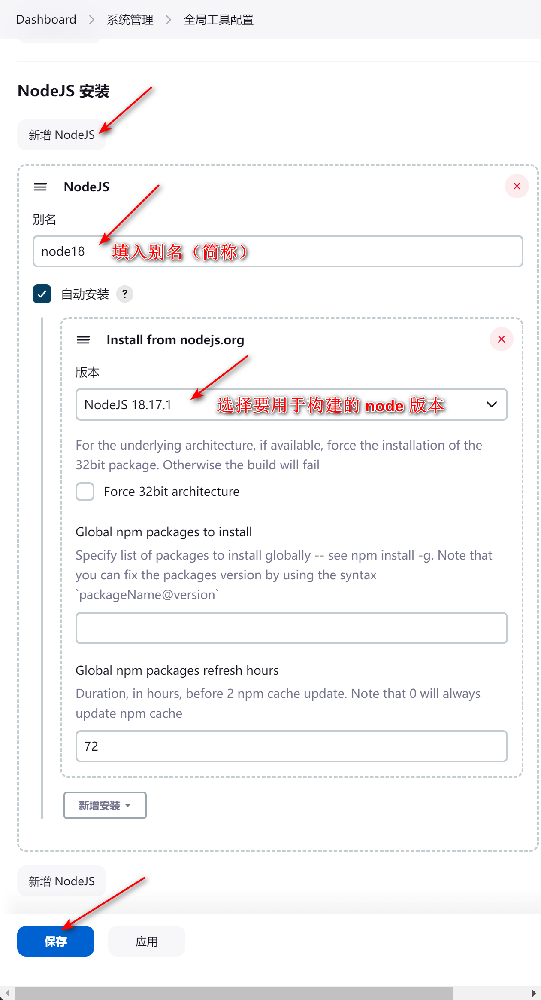
   4. 更换`npm Taobao`源

      1. 依次点开`Dashboard - 系统管理 - Managed files - Add a new Config`

      2. 选择`Npm config file`，最后点击`Next`
         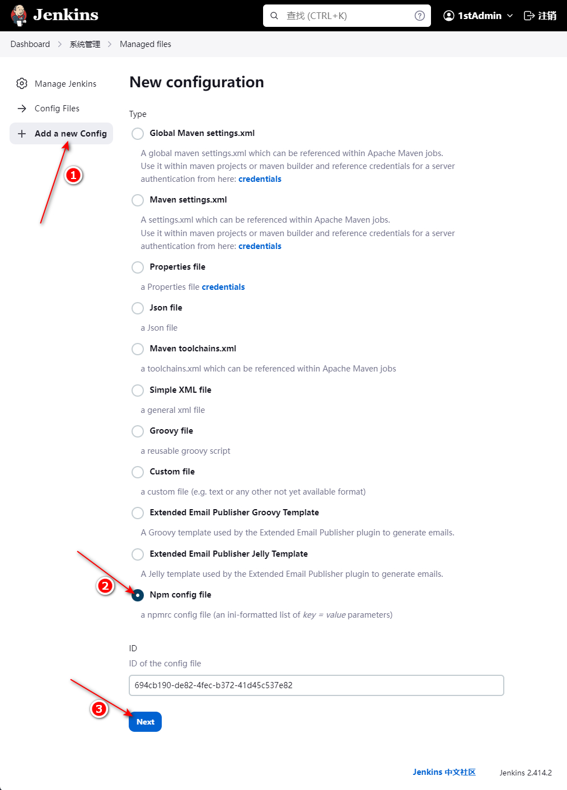

      3. 在新表单中填入名称等必要项后点击`新增`
         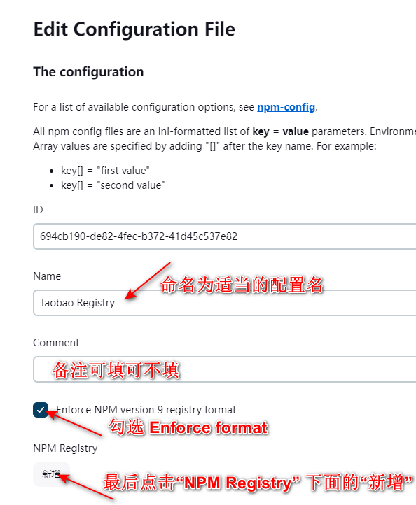

      4. 填入淘宝源：`https://registry.npm.taobao.org`后点击`Submit`
         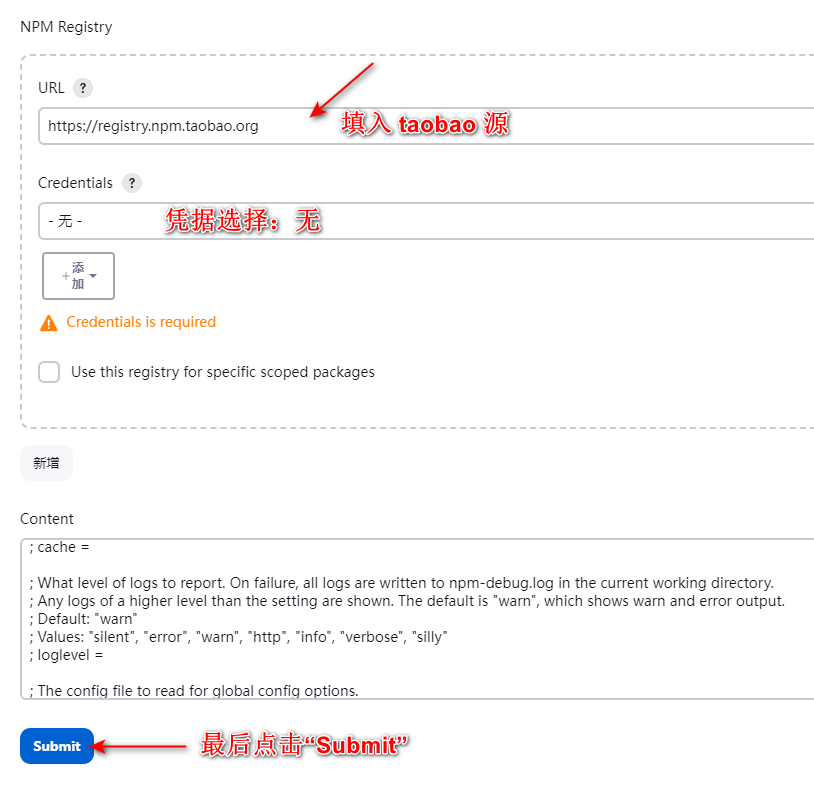

      ::: tip 提示
      也可以不配置更换 npm 源，构建时指定 npm 源也可以：

      ```sh
      npm i --registry https://registry.npm.taobao.org
      ```

      :::

3. `deploy`：部署，需要连接别的服务器`传输文件`并执行`部署脚本`

   1. 安装插件：`Publish over SSH`
   2. 插件安装完成过后依次打开 `Dashboard - 系统管理 - 系统配置`，找到`Publish over SSH`，点击`新增`

      填入服务器 IP、账号密码、根路径以及其他必要信息后点击保存
      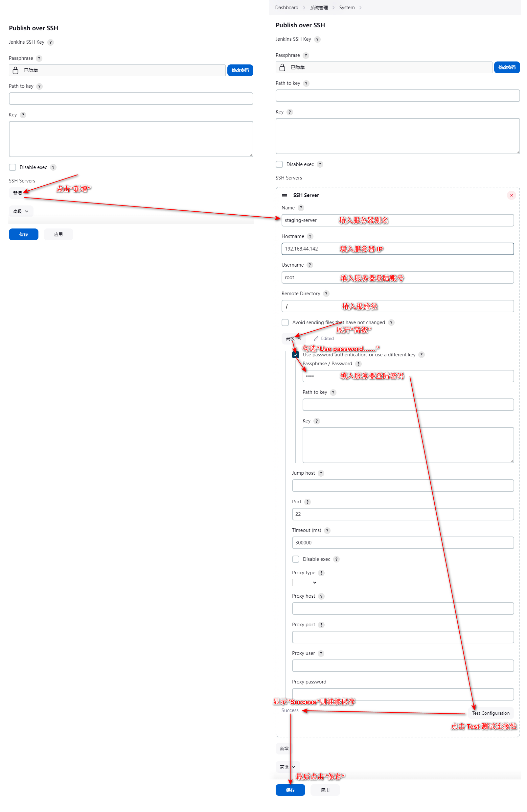

      ::: tip 提示
      构建时调用插件传输文件的路径均是相对于该处填写的`Remote Directory`，因此填写成根路径`/`比较方便
      :::

### 创建 node && npm 构建任务

点击左侧“新建任务”，再分别输入项目名、选择项目类型，最后点击确定

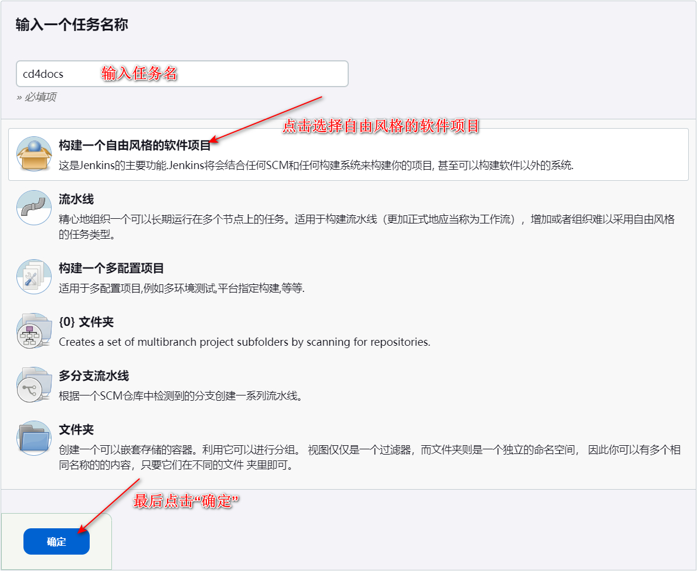

1. 配置源码管理

   选择 `Git`，填入代码`仓库地址`，选择登录 gitlab 的`凭据`，填写`分支`后点击确定
   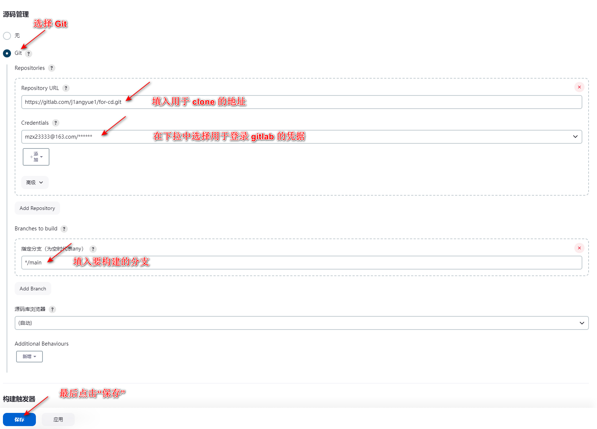

   ::: tip 提示
   该步配置完后最好先执行构建一次，看看能否正常拉取代码，能正常拉取再继续后面的配置
   :::

2. 配置构建环境

   勾选`Provide Node & npm bin/ folder to PATH`，选择要使用的 node 版本、选择 npmrc file，点击保存
   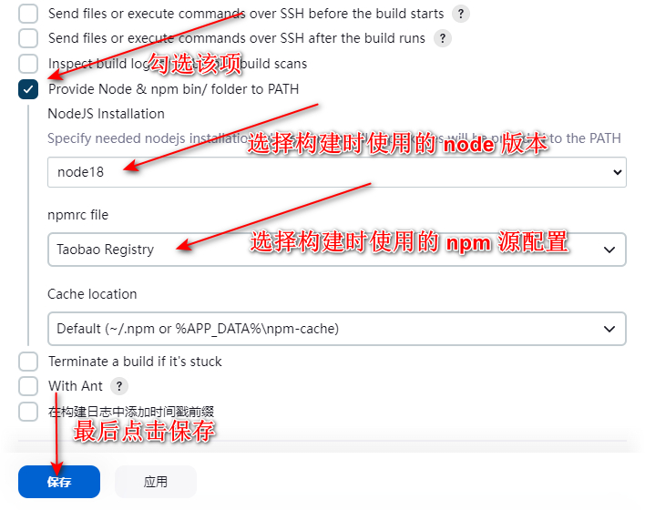

3. 配置构建步骤

   不同于 CD 主要过程，详细的 CD 过程应当如下：
   

   1. 配置步骤：install && build

      在构建任务配置中找到`Build Steps`，下拉选择`执行 shell`
      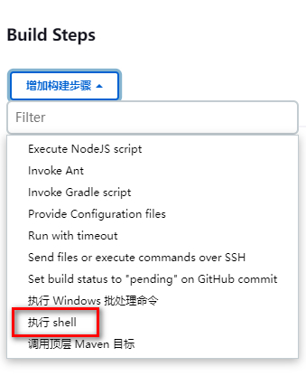

      在`命令`输入框中输入构建命令，以前端构建为例，先安装再构建:

      ```sh
      # 对应步骤：install，安装 node_modules 时会自动使用前面配置的 taobao 源
      npm i
      # 对应步骤：build
      npm run build
      # 压缩构建产物，便于构建后的文件传输；非必需步骤
      tar -czf dist.tar.gz dist
      ```

      ::: tip 提示
      构建后操作也可以传输整个目录，但同体积下传输单个压缩包文件比传输多个极小的文件效率高
      :::

   2. 配置步骤：send && backup && deploy

      在`Build Steps`中下拉选择`Send files or execute commands over SSH`
      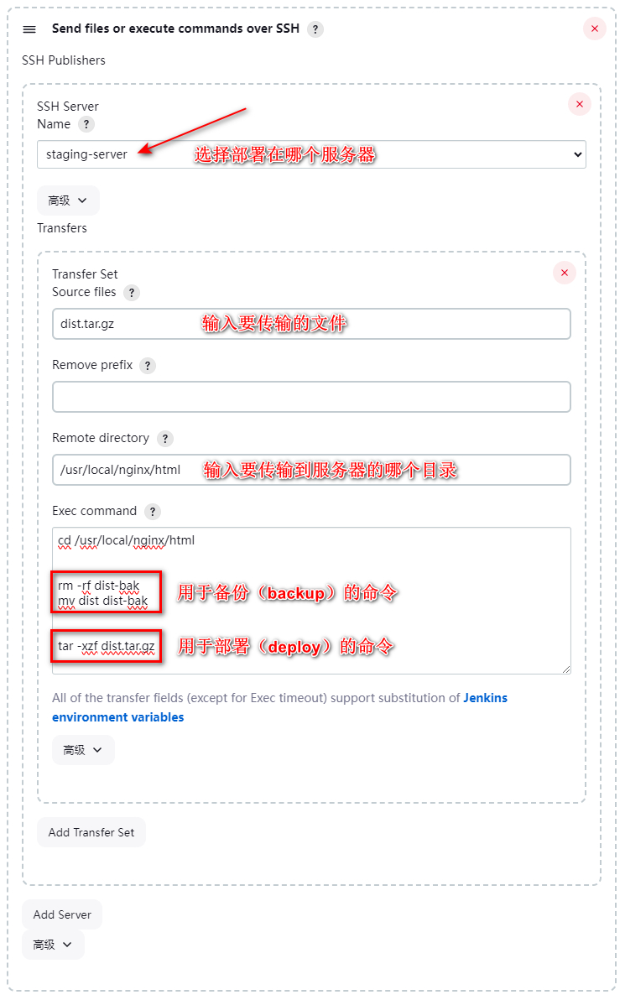

      ```sh
      # 切换到部署路径下
      cd /usr/local/nginx/html
      # 先备份再部署
      # 备份前应当先删除上次的备份，也可以备份上次的备份
      rm -rf dist-bak
      # 重命名文件夹即是备份
      mv dist dist-bak
      # 解压后得到的文件夹即是要部署的内容
      tar -xzf dist.tar.gz
      ```

   3. 配置步骤：clean

      用于构建的目录和用于部署的目录都会产生无用的内容，因此这两个地方都需要进行清除操作

      1. 清除服务器部署目录下无用的内容

         

         尾行增加脚本：

         ```sh
         # 部署后删除传输过来的内容
         rm -f dist.tar.gz
         ```

      2. 清除工作空间构建后无用的内容

         在构建任务配置中找到`Build Steps`，下拉选择`执行 shell`

         使用以下命令：

         ```sh
         rm -f dist.tar.gz
         ```

         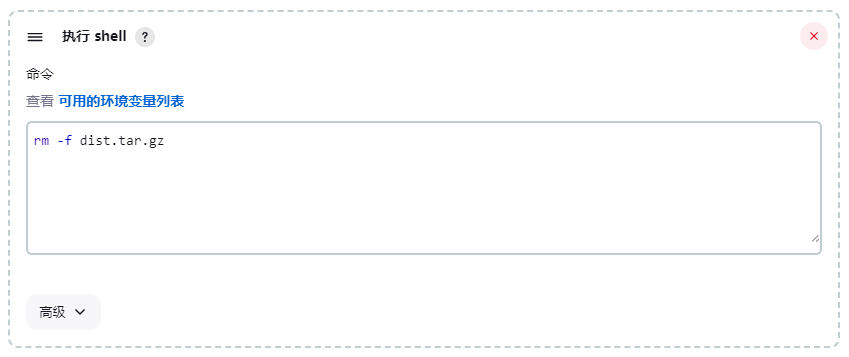

   ::: tip 记得点击“保存”
   :::

   完整的配置如图：
   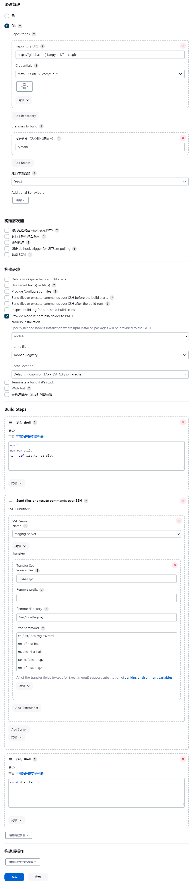
