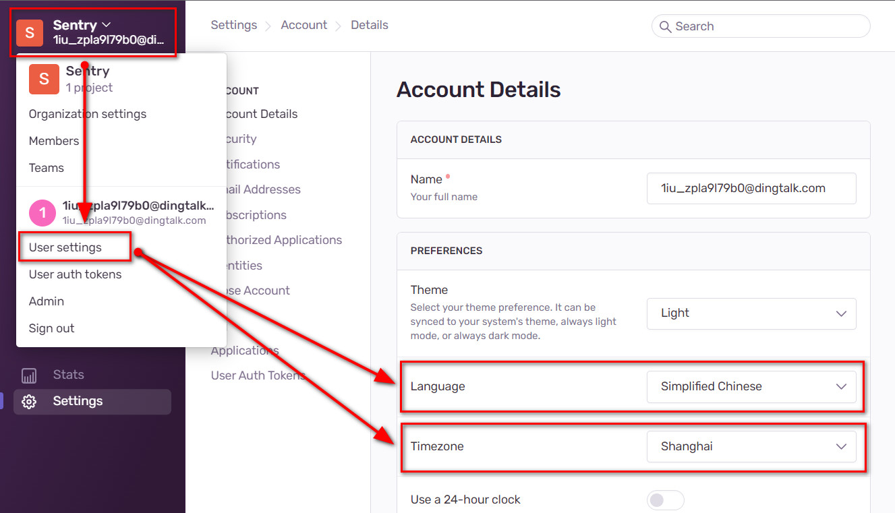
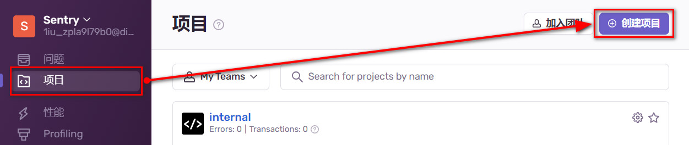
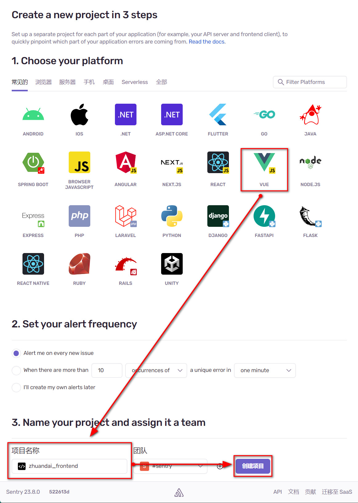
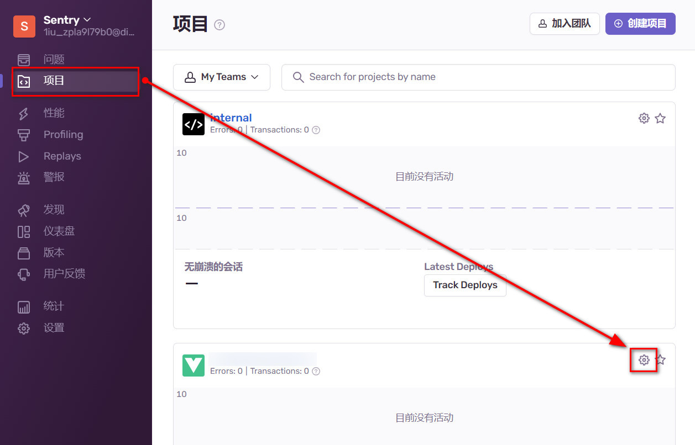
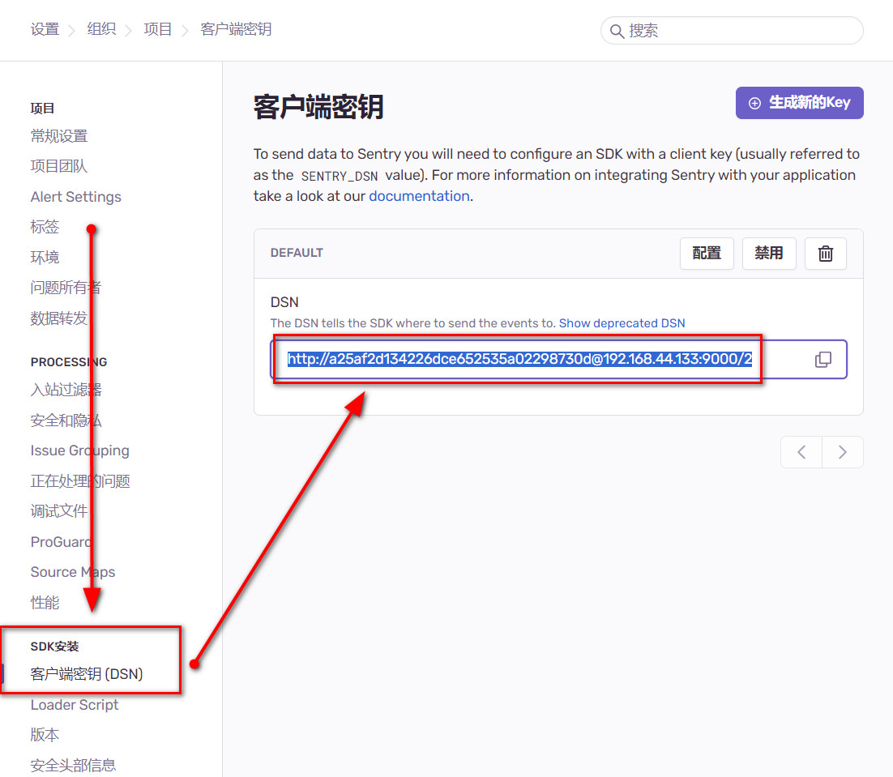
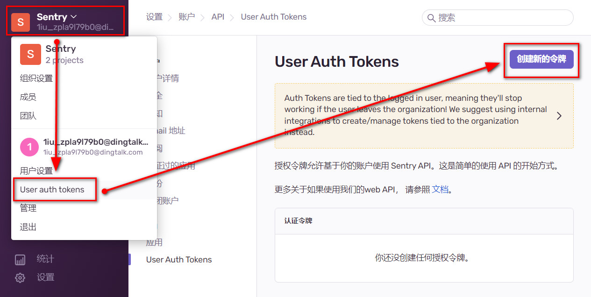
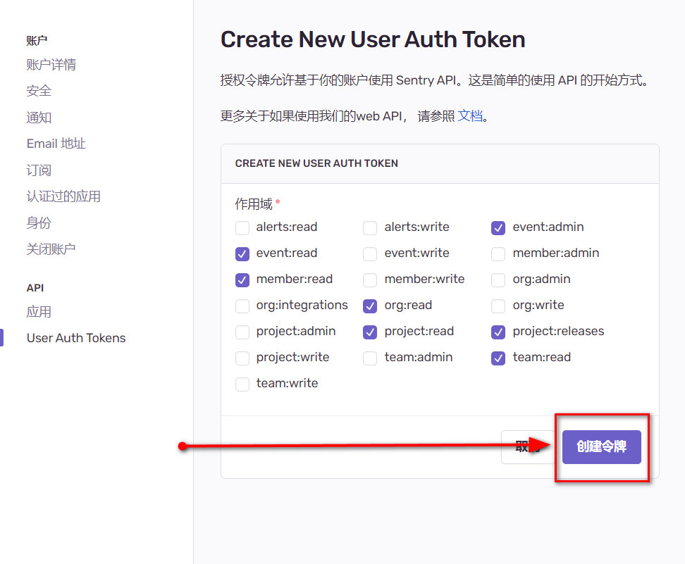
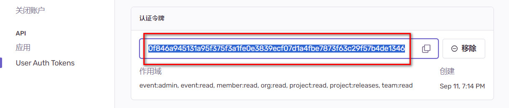
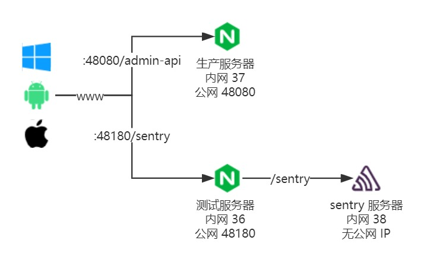

# Sentry 监控平台

搭建自托管私服，不使用 Sentry 开放于互联网的 SaaS 服务

## 下载 & 安装

[官方自托管私服搭建教程](https://develop.sentry.dev/self-hosted/)

### 1. 准备服务器

镜像：`CentOS-7-x86_64-DVD-2009.iso`

硬件配置要求：

- CPU：`4 核` 及以上
- 运存：`3800 MB` 及以上
- 磁盘：`20 GB` 及以上

不满足硬件要求将无法通过 sentry 的校验，无法进行安装

### 2. 安装 docker 和 docker-compose

[Docker 官方教程](https://docs.docker.com/engine/install/centos/)

1.  移除旧版 docker

    ```sh
    sudo yum remove docker \
                   docker-client \
                   docker-client-latest \
                   docker-common \
                   docker-latest \
                   docker-latest-logrotate \
                   docker-logrotate \
                   docker-engine
    ```

2.  安装 yum 并设置 yum&docker 源

    ```sh
    sudo yum install -y yum-utils
    sudo yum-config-manager --add-repo https://download.docker.com/linux/centos/docker-ce.repo
    ```

3.  安装 docker 和 docker-compose

    ```sh
    sudo yum install docker-ce docker-ce-cli containerd.io docker-buildx-plugin docker-compose-plugin
    ```

4.  启动 docker

    ```sh
    systemctl start docker
    ```

### 3. 下载 sentry

[所有的 release 版本下载地址](https://github.com/getsentry/self-hosted/releases)

ZDB 使用的版本是 [self-hosted-23.8.0](https://github.com/getsentry/self-hosted/releases/tag/23.8.0)

下载后得到 `self-hosted-23.8.0.tar.gz`

### 4. 安装 sentry

```sh
# 将压缩包移动到 /usr/local 后再执行 tar 命令
cd /usr/local
# 解压完成后得到 self-hosted-23.8.0 目录
tar -zxvf self-hosted-23.8.0.tar.gz
# 重命名目录，方便查找与进入
mv self-hosted-23.8.0 setnry
cd setnry
./install.sh
```

不是非得放在 `/usr/local`，非系统关键位置都可以

该步：`▶ Fetching and updating Docker images ...`会卡住较长时间，解决方法：

1.  等待几十分钟后若仍然不动直接按下`Ctrl + C`结束进程即可，结束后再次执行`./install.sh`，多等待几次，多结束几次，安装就能进行到下一步；或者参考 2\3

2.  设置 docker 国内镜像源

    ```sh
    sudo mkdir -p /etc/docker
    sudo tee /etc/docker/daemon.json <<-'EOF'
    {
       "registry-mirrors": ["https://rsm2lnlp.mirror.aliyuncs.com"]
    }
    EOF
    sudo systemctl daemon-reload
    sudo systemctl restart docker
    ```

3.  加速 github (`23.8.0: Pulling from getsentry/sentry`)、魔法上网

### 5. 创建首个账号

`Would you like to create a user account now? [Y/n]: Y`

输入邮箱（账号）、密码即完成安装

## 启/停 sentry

docker 未启动时应当先启动 docker

```sh
systemctl start docker
```

启动 sentry 服务

```sh
cd /usr/local/sentry
docker compose up -d
```

停止 sentry 服务

```sh
cd /usr/local/sentry
docker compose down
```

## 首次访问 sentry

浏览器访问 `http://${服务器IP}:9000`，输入安装时创建的账号密码进行登录

登陆后将跳转到一个初始配置页面，可以不做任何配置改动，直接点击底部 `continue` 按钮。

点击左上角`Sentry`文字，再点击下拉菜单中的`User settings`：

- 将 `Language`设置为`Simplified Chinese`
- 将 `Timezone`设置为`Shanghai`
- 刷新浏览器后界面就变成了中文



## 使用 sentry

### 1. 在 sentry 创建项目

点击左侧菜单项`项目`，再点击右上角`创建项目`



平台选择`VUE`，在页面底部`项目名称`处填入项目名称，最后点击`创建项目`

::: tip 提示
项目名称依据自己的真实项目随意填写，这里只是以`zhuandai_frontend`为例
:::



### 2. Vue 前端项目集成 sentry SDK

[官方集成教程](https://docs.sentry.io/platforms/javascript/guides/vue/)

以下为简单集成方式，后续需要添加 `version` 以及 `environment`

#### 1. 安装 SDK

```sh
npm i @sentry/vue
```

#### 2. 获取 DSN 客户端密钥

DSN 是一个字符串，包含了明文密钥和 sentry 服务的 IP、端口号等信息。在前端初始化 SDK 时传入 DSN，SDK 通过解析这个 DSN 字符串获得上报的权限以及知道向哪里上报事件。

点击左侧菜单项`项目`，再点击该项目的齿轮图标



点击左侧`客户端密钥 (DSN)`，再双击右侧 `DSN` 输入框内的文字进行全选，全选后进行复制



#### 3. 引入 & 初始化 SDK

```js
import { init, BrowserTracing, vueRouterInstrumentation } from "@sentry/vue";

function setupSentry(app, router) {
  init({
    app,
    // 填入 DSN
    dsn: "填入复制的 DSN",
    integrations: [
      new BrowserTracing({
        routingInstrumentation: vueRouterInstrumentation(router),
      }),
    ],
  });
}

// Now in main.js
import { createApp } from "vue";
import { createRouter } from "vue-router";

const app = createApp(/* App.vue */);
const router = createRouter(/* { options } */);

// 必须先初始化 sentry 再 mount
setupSentry(app, router);
app.mount("#app");
```

::: warning 提示
SDK 不会在开发模式下上报异常，构建后才能看到上报的请求
:::

### 3. 上传 sourcemap

#### 1. 安装上传插件

```sh
npm i @sentry/vite-plugin -D
```

#### 2. 获取 authToken

点击左上角，选择`User auth tokens`，再点击`创建新的令牌`



作用域使用默认即可，最后点击`创建令牌`



双击右侧 `认证令牌` 输入框内的文字进行全选，全选后进行复制



#### 3. 引入 & 初始化上传插件

```js
// vite.config.js
import { sentryVitePlugin } from "@sentry/vite-plugin";

export default {
  // 省略其他配置
  ...,
  // sourcmap 应当设置为 true
  sourcemap: true,
  plugins: [
    // 省略其他插件
    ...,
    // Put the Sentry vite plugin after all other plugins
    sentryVitePlugin({
      authToken: "填入复制的 authToken",
      // 填入组织 ID，默认都是 sentry
      org: "sentry",
      // 项目名称
      project: "zhuandai_frontend",
      // sentry 服务的 IP + PORT
      url: `http://${服务器IP}:9000`,
    }),
  ],
};
```

构建成功后、完成前会自动上传

::: warning 提示
依据 sentry 官方提示与要求，`sentryVitePlugin` 应当位于 `plugins` 的最后
:::

## ZDB 使用中的客制化

客制化哪些内容由 ZDB 的服务器情况决定：

`sentry`部署在一个内网服务器上，只能通过内部网络访问 sentry 服务器，外部互联网无法直接访问 sentry 服务器发送上报请求。
因此上报异常的请求先到达测试服务器上，由测试服务器上的`nginx`走内网转发代理到`sentry`服务器上。



无法更改时区
https://github.com/getsentry/self-hosted/issues/2405

1. 修改 URL-PREFIX

管理 -》 settings 根 url ：https://zdb.sdf.red:48180/sentry
