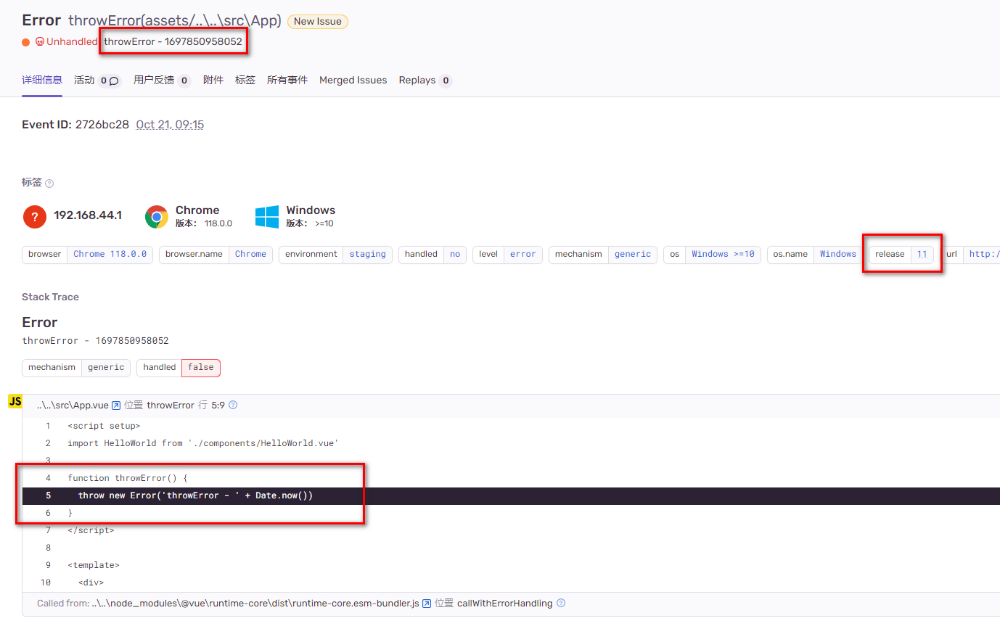
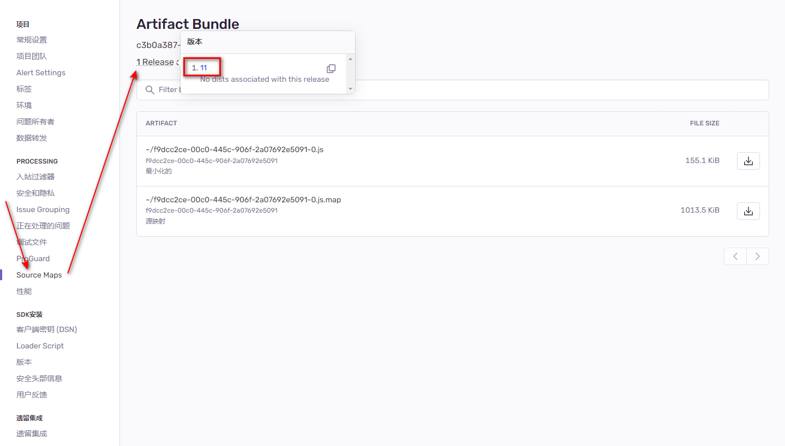
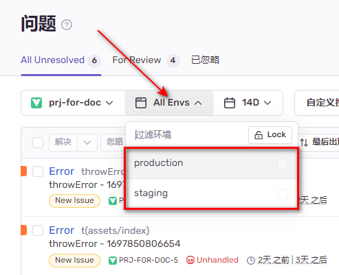

# Sentry 监控平台

搭建自托管私服，不使用 Sentry 开放于互联网的 SaaS 服务

## 下载 && 安装

[官方自托管私服搭建教程](https://develop.sentry.dev/self-hosted/)

### 1. 准备服务器

镜像：`CentOS-7-x86_64-DVD-2009.iso`

硬件配置要求：

- CPU：`4 核` 及以上
- 运存：`3800 MB` 及以上
- 磁盘：`20 GB` 及以上

不满足硬件要求将无法通过 sentry 的校验，无法进行安装

### 2. 安装 docker 和 docker-compose

[Docker 官方教程](https://docs.docker.com/engine/install/centos/)

1.  移除旧版 docker

    ```sh
    sudo yum remove docker \
                   docker-client \
                   docker-client-latest \
                   docker-common \
                   docker-latest \
                   docker-latest-logrotate \
                   docker-logrotate \
                   docker-engine
    ```

2.  安装 yum 并设置 yum&docker 源

    ```sh
    sudo yum install -y yum-utils
    sudo yum-config-manager --add-repo https://download.docker.com/linux/centos/docker-ce.repo
    ```

3.  安装 docker 和 docker-compose

    ```sh
    sudo yum install docker-ce docker-ce-cli containerd.io docker-buildx-plugin docker-compose-plugin
    ```

4.  启动 docker

    ```sh
    systemctl start docker
    ```

### 3. 下载 sentry

[所有的 release 版本下载地址](https://github.com/getsentry/self-hosted/releases)

ZDB 使用的版本是 [self-hosted-23.8.0](https://github.com/getsentry/self-hosted/releases/tag/23.8.0)

下载后得到 `self-hosted-23.8.0.tar.gz`

### 4. 安装 sentry

```sh
# 将压缩包移动到 /usr/local 后再执行 tar 命令
cd /usr/local
# 解压完成后得到 self-hosted-23.8.0 目录
tar -zxvf self-hosted-23.8.0.tar.gz
# 重命名目录，方便查找与进入
mv self-hosted-23.8.0 setnry
cd setnry
./install.sh
```

不是非得放在 `/usr/local`，非系统关键位置都可以

该步：`▶ Fetching and updating Docker images ...`会卡住较长时间，解决方法：

1.  等待 20~30 十分钟后若仍然不动直接按下`Ctrl + C`结束进程即可，结束后再次执行`./install.sh`，多等待几次，多结束几次，安装就能进行到下一步；或者参考 2\3

2.  [提升镜像拉取速度](/jenkins/index.md#提升镜像拉取速度（可选）)

3.  加速 github (`23.8.0: Pulling from getsentry/sentry`)、魔法上网

### 5. 创建首个账号

`Would you like to create a user account now? [Y/n]: Y`

输入邮箱（账号）、密码即完成安装

## 启/停 sentry

docker 未启动时应当先启动 docker

```sh
systemctl start docker
```

启动 sentry 服务

```sh
cd /usr/local/sentry
docker compose up -d
```

停止 sentry 服务

```sh
cd /usr/local/sentry
docker compose down
```

## 首次访问 sentry

浏览器访问 `http://${服务器IP}:9000`，输入安装时创建的账号密码进行登录

登陆后将跳转到一个初始配置页面，可以不做任何配置改动，直接点击底部 `continue` 按钮。

点击左上角`Sentry`文字，再点击下拉菜单中的`User settings`：

- 将 `Language`设置为`Simplified Chinese`
- 将 `Timezone`设置为`Shanghai`（[修复无法更改时区的问题](https://github.com/getsentry/self-hosted/issues/2405)
  ）
- 刷新浏览器后界面就变成了中文


## 使用 sentry

### 1. 在 sentry 创建项目

点击左侧菜单项`项目`，再点击右上角`创建项目`


平台选择`VUE`，在页面底部`项目名称`处填入项目名称，最后点击`创建项目`

::: tip 提示
项目名称依据自己的真实项目随意填写，这里只是以`frontend`为例
:::


### 2. Vue 前端项目集成 sentry SDK

[官方集成教程](https://docs.sentry.io/platforms/javascript/guides/vue/)

以下为简单集成方式，后续需要添加 `version` 以及 `environment`

#### 1. 安装 SDK

```sh
npm i @sentry/vue
```

#### 2. 获取 DSN 客户端密钥

DSN 是一个字符串，包含了明文密钥和 sentry 服务的 IP、端口号等信息。在前端初始化 SDK 时传入 DSN，SDK 通过解析这个 DSN 字符串获得上报的权限以及知道向哪里上报事件。

点击左侧菜单项`项目`，再点击该项目的齿轮图标


点击左侧`客户端密钥 (DSN)`，再双击右侧 `DSN` 输入框内的文字进行全选，全选后进行复制


#### 3. 引入 && 初始化 SDK

```js
import { init, BrowserTracing, vueRouterInstrumentation } from "@sentry/vue";

function setupSentry(app, router) {
  init({
    app,
    // 填入 DSN
    dsn: "填入复制的 DSN",
    integrations: [
      new BrowserTracing({
        routingInstrumentation: vueRouterInstrumentation(router),
      }),
    ],
  });
}

import { createApp } from "vue";
import { createRouter } from "vue-router";

const app = createApp(/* App.vue */);
const router = createRouter(/* { options } */);

// 必须先初始化 sentry 再 mount，否则 mount 期间报错了 sentry 捕获不到也就无法上报
setupSentry(app, router);
app.mount("#app");
```

::: warning 提示
SDK 不会在开发模式下上报异常，构建后才能看到上报的请求
:::

### 3. 上传 sourcemap

#### 1. 安装上传插件

```sh
npm i @sentry/vite-plugin -D
```

#### 2. 获取 authToken

点击左上角，选择`User auth tokens`，再点击`创建新的令牌`


作用域使用默认即可，最后点击`创建令牌`


双击右侧 `认证令牌` 输入框内的文字进行全选，全选后进行复制


#### 3. 引入 && 初始化上传插件

```js
// vite.config.js
import { sentryVitePlugin } from "@sentry/vite-plugin";

export default {
  // 省略其他配置
  ...,
  // sourcmap 应当设置为 true
  sourcemap: true,
  plugins: [
    // 省略其他插件
    ...,
    // Put the Sentry vite plugin after all other plugins
    sentryVitePlugin({
      authToken: "填入复制的 authToken",
      // 填入组织 ID，默认都是 sentry
      org: "sentry",
      // 项目名称
      project: "填入项目名",
      // sentry 服务的 IP + PORT
      url: `http://${服务器IP}:9000`,
      // 关闭日志显示，想看上传日志可设置为 false
      slient: true,
      sourcemaps: {
        // 上传完成后删除 sourcemap 文件
        // 防止意外将 sourcemap 文件部署到生产环境导致源码泄露
        filesToDeleteAfterUpload: "**/*.js.map",
      }
    }),
  ],
};
```

构建成功后、完成前会自动上传

## 集成 release

为了能让`sentry` 正确映射错误发生的文件与行数，上报时的 `release` 和上传 `sourcemap` 时的 `release` 应当保持相同

当没有手动设置 `release` 时，sentry 会自己生成 `release`，因此在 `init` 时和上传时要么都设置并且设置成相同的，要么就都不要设置

集成 `release` 需要配置两个地方： `sentryVitePlugin` 和 `Sentry.init`

假设版本号是通过[命令行注入的环境变量](../vite-vue/index.md#注入自定义环境变量)，假设注入的版本号环境变量名是 `__RELEASE_4_SENTRY__`：

```sh
npx cross-env __RELEASE_4_SENTRY__=${releaseNo} __IS_CREATE_SOURCE_MAP__=1 vite build
```

### 1. 配置 `sentryVitePlugin`

```js
// vite.config.js
import { sentryVitePlugin } from "@sentry/vite-plugin";

// 读取环境变量
const RELEASE_NAME = process.env.__RELEASE_4_SENTRY__
const IS_IS_CREATE_SOURCE_MAP = !!process.env.__CREATE_SOURCE_MAP__

export default {
  // 省略其他配置
  ...,
  sourcemap: IS_CREATE_SOURCE_MAP,
  // 定义 release 版本号全局常量，应用代码中 Sentry.init() 时使用
  define: {
    __RELEASE_4_SENTRY__: JSON.stringify(RELEASE_NAME)
  },
  plugins: [
    // 省略其他插件
    ...,
    sentryVitePlugin({
      // 新增 release 配置项
      release: {
        // vite 插件内的 release.name 要与 Sentry.init 时的 release 保持相同
        name: RELEASE_NAME
      },
      // 可以配置也可以不配置，通常情况下是不生成 sourcemap 就不用上传
      disabled: !IS_CREATE_SOURCE_MAP
      // 以下配置与集成 release 无关无需改动
      authToken: "...",
      org: "...",
      project: "...",
      url: "...",
    }),
  ],
};
```

### 2. 配置 `Sentry.init`

```js
import { init, BrowserTracing } from "@sentry/vue";

function setupSentry(app, router) {
  init({
    // 在 vite.config.js 的 define 中设置的该全局常量
    release: __RELEASE_4_SENTRY__,
    app,
    dsn: "填入 DSN",
    integrations: [
      new BrowserTracing({
        routingInstrumentation: vueRouterInstrumentation(router),
      }),
    ],
  });
}
```

### 3. 查看最终效果

某次构建指定版本号为`11`、生成 `sourcemap`，使用构建命令：

```sh
npx cross-env __RELEASE_4_SENTRY__=11 __IS_CREATE_SOURCE_MAP__=1 vite build
```

查看错误详情、报错文件及行数：



查看 `sourcemap` 及对应的版本号：



## 集成 environment

环境一般分为：生产环境、测试环境、开发环境，通常来说开发环境完全没有上报的必要。

集成 `environment` 只需要配置 `Sentry.init` 即可，不需要配置 `sentryVitePlugin`

`environment` 的值使用 `import.meta.env.MODE` 即可：

1. `vite build` 时 `import.meta.env.MODE` 的值是 `"production"`

2. `vite build --mode ${MODE}` 时 `import.meta.env.MODE` 的值是 `${MODE}`

3. `environment` 值可以完全自定义，不是必须为 `"production"`

### 1. 配置 `Sentry.init`

```js
import { init, BrowserTracing } from "@sentry/vue";

function setupSentry(app, router) {
  init({
    // 设置 `environment`
    environment: import.meta.env.MODE,
    app,
    dsn: "填入 DSN",
    integrations: [
      new BrowserTracing({
        routingInstrumentation: vueRouterInstrumentation(router),
      }),
    ],
  });
}
```

使用以下命令构建：

```sh
vite build
# OR
vite build --mode staging
```

### 2. 查看最终效果

搜索条件处点击 `All Envs`，下拉中可根据环境变量筛选



## 上报时携带用户信息

在 `init` 时设置 `beforeSend`

```javascript
import { init } from "@sentry/vue";
import useUserStore from "@/store/user";

let userStore = null;

init({
  // 省略其他配置……
  // 在 beforeSend 内设置 event.user.*
  beforeSend(event) {
    userStore = userStore || useUserStore();

    if (userStore?.user) {
      event.user = event.user || {};
      event.user.id = userStore.user.id;
      event.user.username = userStore.user.nickname;
    }

    return event;
  },
});
```

## ZDB 使用中的客制化

### 1. 公网转发上报请求

目的是让上报异常的请求走测试服务器而不是生产服务器，节省服务器资源

要达成的效果：


如上图，ZDB 的`sentry`部署在一个内网服务器上，只能通过内部网络访问 `sentry` 服务器，外部互联网无法直接访问 sentry 服务器并发送上报请求。
因此生产环境上报异常的请求先到达`测试服务器`上，由`测试服务器`上的`nginx`走内网转发代理到`sentry`服务器上。

#### 1. 修改 DSN

sentry 提供的 DSN 通常为以下格式：

`https://${HASH}@${SENTRY_SERVER_IP}:${SENTRY_SERVER_PORT}/${PROJECT_ID}`

sentry 前端 sdk 依据 DSN 向 `https://${SENTRY_SERVER_IP}:${SENTRY_SERVER_PORT}` 发送请求，将 DSN 中的 `SENTRY_SERVER_IP` 和 `SENTRY_SERVER_PORT` 改为公网的 IP(域名) 和端口号，再由公网的 IP 背后的这台服务器将请求转发到 sentry 服务器即可

比如要让`sentry`的请求都转发到 sentry 服务器，DSN 应当改成：`https://${HASH}@${PUBLIC_IP}:${PUBLIC_PORT}/sentry/${PROJECT_ID}`，即：

- SENTRY_SERVER_IP 换成公网域名
- SENTRY_SERVER_PORT 换成公网端口号
- 端口号后增加用于转发的前缀

此时 sentry 前端 sdk 依据 DSN 向 `https://${PUBLIC_HOST}:${PUBLIC_PORT}/sentry` 发送请求

#### 2. 修改公网的 IP 服务器的 nginx 配置

```nginx.conf
# 将 /sentry 开头的请求转发到真实 sentry 服务上
location /sentry {
    http://${SENTRY_SERVER_IP}:9000/;
}
```

#### 3. 其他可用方案

即：修改 `根 URL`（Root Url）。修改了之后 sentry 本身的服务也出现了一些问题所以放弃了这个方案，改为修改 DSN

### 2. 解决钉钉移动端 H5 微应用内无法上报异常的问题

在多次提交了工单与技术支持、开发人员争执、讨论后，终于找到了问题的原因。期间钉钉的开发人员明知道自己代码有问题却非要怪我们的服务器有问题，都不肯动手测试一下。😒

问题原因：

1. 钉钉移动端 `webview` 存在问题，使用 `fetch` 发送请求钉钉会将 `body` 置为空，导致服务器返回 `400`

2. `sentry` 上报默认使用 `fetch`，因此无法上报

解决方法：

使用 `xhr` 上报而不使用 `fetch`

```js
import { init } from "@sentry/vue";
import { makeXHRTransport } from "@sentry/browser";

init({
  // 省略其他配置……
  transport: makeXHRTransport,
});
```
